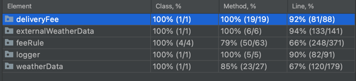

# FoodDeliveryDemoApp

## About this project

This project is a technical task.

## Prerequisites

* [Java 17](https://www.oracle.com/java/technologies/javase/jdk17-archive-downloads.html)
  ```sh
  https://www.oracle.com/java/technologies/javase/jdk17-archive-downloads.html
  ```

* [Maven](https://maven.apache.org/download.cgi)
  ```sh
  https://maven.apache.org/download.cgi
  ```

## Build

1. Download .zip or clone project from GitHub.

2. Unzip and/or go to project location in __terminal__.

3. Build the project using maven
   ```sh
   mvn clean package
   ```
   
4. Run the project
   ```sh
   java -jar ./target/FoodDeliveryDemoApp-1.0-SNAPSHOT.jar
   ```
   
5. Now you can use the project.

6. Use [Swagger UI](http://localhost:8080/swagger-ui/index.html) to test the endpoints.

P.S. Scheduled task gets data right after start of the application and then every hour at 15 minutes.
If you want to get latest data when you want use __/get-weather-from-eea__ endpoint.


## How to use

Use [Swagger UI](http://localhost:8080/swagger-ui/index.html) to test the endpoints.


Swagger UI is powered by SpringDoc OpenAPI (v2.0.4) [springdoc-openapi v2.0.4](https://springdoc.org/v2/)

Postman can also be used, as well as CURL etc. \
Most of the validation supports exception handling for empty parameters.

## Tests and how to run them from maven

There are unit tests and integration tests. Each of them use different environment(database).

By default, while building the project only unit tests run automatically.
If you want to run the integration tests, refer to the instruction below.

### How to run from maven

* Integration tests

1. Build the project using maven
   ```sh
   mvn clean package
   ```
   
2. Run integration tests
    ```sh
   mvn test -Dtest=**IT.java
   ```
   
- Unit tests 
  
  - Build the project using maven (unit tests run automatically)
       ```sh
       mvn clean package
       ```
    
  - To run only the application unit tests just type the following command:
    ```shell
    mvn test
    ```
    
  - To skip unit tests via command line during compilation just add the parameter `-DskipTests=true`:
    ```shell
    mvn clean package -DskipTests=true 
    ```
  
### Coverage

1. All methods in controllers are covered by tests.

   

2. Most of the service methods and lines are covered by tests.

   

## Objectives

1. Database for storing and manipulating data ✅
2. Configurable scheduled task for importing weather data (CronJob) ✅
3. Functionality to calculate delivery fee ✅
4. REST interface, which enables to request of the delivery fee according to input parameters ✅
   
### Bonuses

1. Bonus 1. CRUD REST interface for regional base fees and extra fees for weather conditions. ✅
2. Bonus 2. Datetime in REST interface request. ✅

### Additional

There are some more additions in my solution that were not listed in the task.

## TODOS

1. _>90%_ test coverage in services.
2. Make integration test environment better. (RepositoryInitializer, DatabaseCleanupTestExecutionListener)